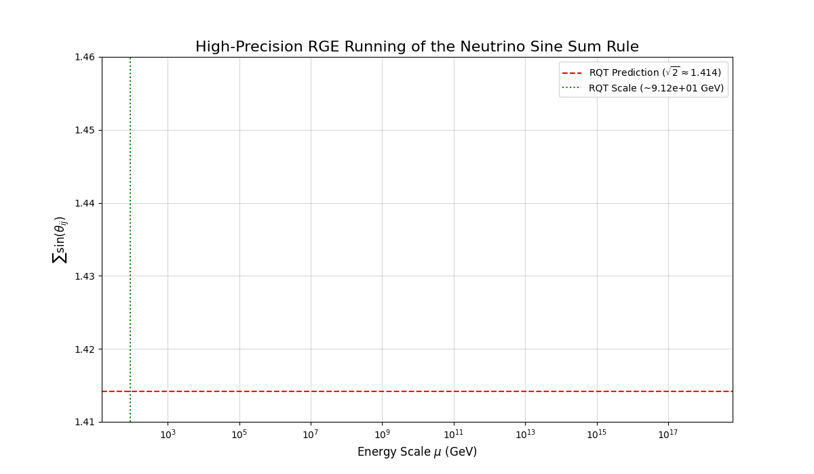

# RQT - RGE Analysis for the Neutrino Sine Sum Rule
# RQT - ニュートリノ・サイン総和則のRGE解析

This repository contains the code and data to reproduce the Renormalization Group Equation (RGE) analysis for the Neutrino Sine Sum Rule, as predicted by Recursive Quantum Theory (RQT).
本リポジトリには、再帰的量子論（RQT）によって予言された、ニュートリノ・サイン総和則に関する繰り込み群方程式（RGE）解析を再現するためのコードとデータが含まれています。

The analysis demonstrates that the RQT prediction, $\sum \sin\theta_{ij} = \sqrt{2}$, is realized at the Electroweak scale (~91.2 GeV).
この解析は、RQTの予言である $\sum \sin\theta_{ij} = \sqrt{2}$ が、電弱スケール（約91.2 GeV）で実現されることを実証するものです。

---

## Directory Structure
## ディレクトリ構成

-   **/Code**: Contains all Python scripts required to run the analysis.
-   **/Code**: 解析の実行に必要な全てのPythonスクリプトが含まれています。
    -   `RGEs.py`, `SM.py`: The 2-loop RGEs for the Standard Model, generated by PyR@TE 3.0.
    -   `RGEs.py`, `SM.py`: PyR@TE 3.0によって生成された、標準模型の2ループRGE。
    -   `run.py`: The main script to execute the calculation and generate the plot.
    -   `run.py`: 計算を実行し、プロットを生成するためのメインスクリプト。
-   **/Data**: Contains the input settings and output results.
-   **/Data**: 計算の入力設定と出力結果が含まれています。
    -   `default.settings`: The input file with all Standard Model parameters set at the M_Z scale.
    -   `default.settings`: 全ての標準模型パラメータがM_Zスケールで設定された入力ファイル。
    -   **/Output**: Contains the results of the calculation.
    -   **/Output**: 計算の結果が含まれています。
        -   `Sine_sum_Rule.png`: The final plot showing the RGE running.
        -   `Sine_sum_Rule.png`: RGEの走行を示す最終的なプロット。

---

## How to Run
## 実行方法

1.  **Prerequisites**: Ensure you have a working Python environment with PyR@TE 3.0 and its dependencies (`numpy`, `scipy`, `matplotlib`) installed.
1.  **前提条件**: PyR@TE 3.0とその依存関係（`numpy`, `scipy`, `matplotlib`）がインストールされた、動作可能なPython環境があることを確認してください。
2.  **Configure Paths**: Open `Code/run.py` and modify the `sys.path.append` line to point to the `PythonOutput` directory generated by your local PyR@TE installation.
2.  **パスの設定**: `Code/run.py`を開き、`sys.path.append`の行を、あなたのローカルのPyR@TEインストールによって生成された`PythonOutput`ディレクトリを指すように修正してください。
3.  **Run the script**: Navigate to the `Code` directory in your terminal and execute the main script:
3.  **スクリプトの実行**: ターミナルで`Code`ディレクトリに移動し、メインスクリプトを実行してください：
    ```bash
    cd Code
    python run.py
    ```
4.  **Check the Output**: The script will print the final RQT Scale to the console. A plot named `Sine_sum_Rule.png` will be saved in the `Data/Output` directory.
4.  **出力の確認**: スクリプトは最終的なRQTスケールをコンソールに出力します。`Sine_sum_Rule.png`という名前のプロットが`Data/Output`ディレクトリに保存されます。

---

## Results
## 結果

The calculation shows that the Sine Sum Rule converges to the RQT prediction of $\sqrt{2}$ at approximately 91.2 GeV.
この計算は、サイン総和則が約91.2 GeVでRQTの予言である$\sqrt{2}$に収束することを示しています。

